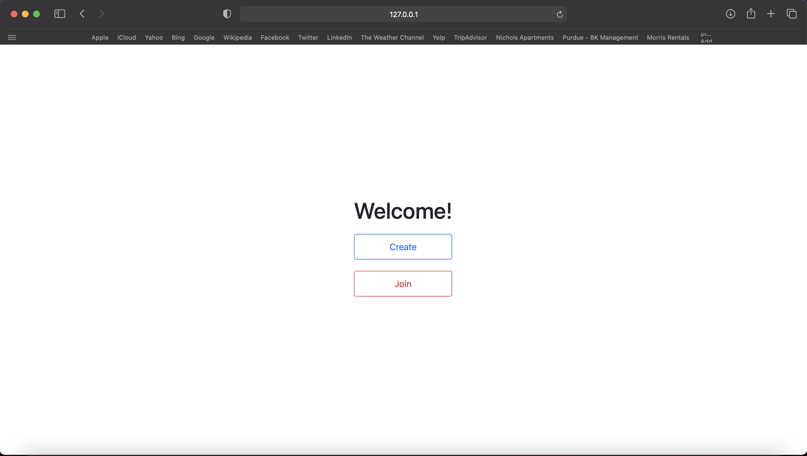
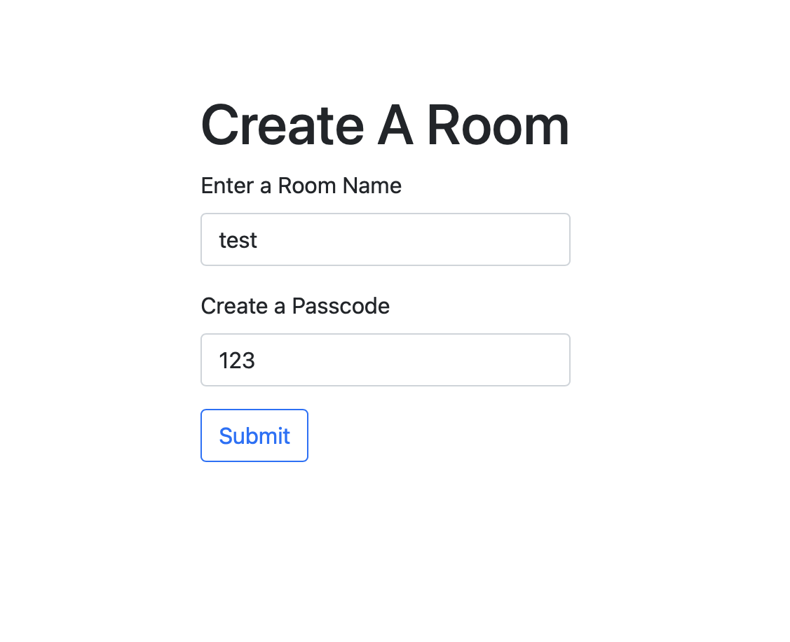
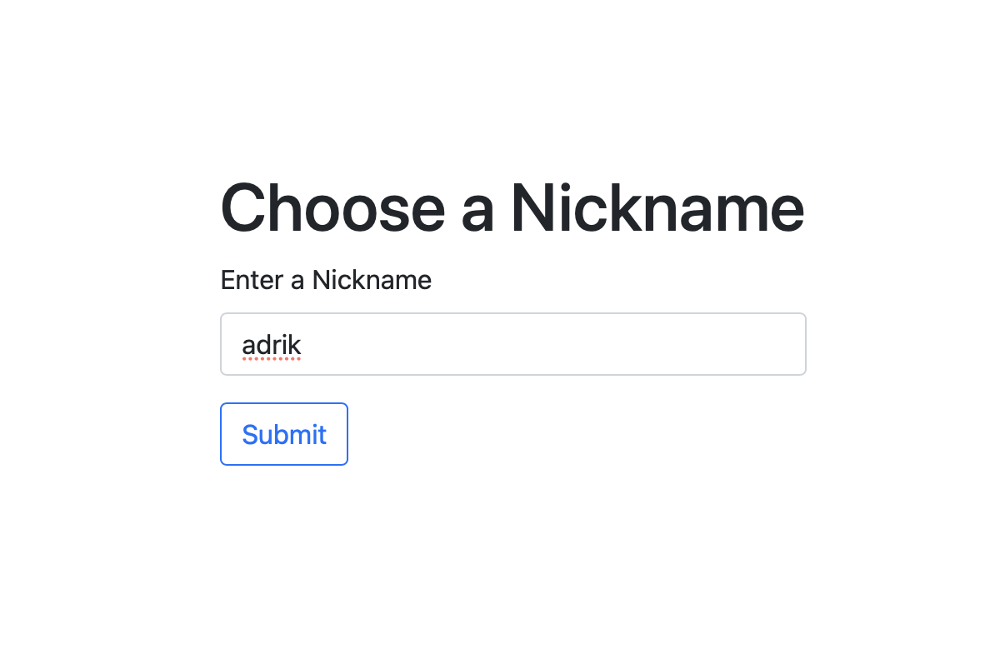
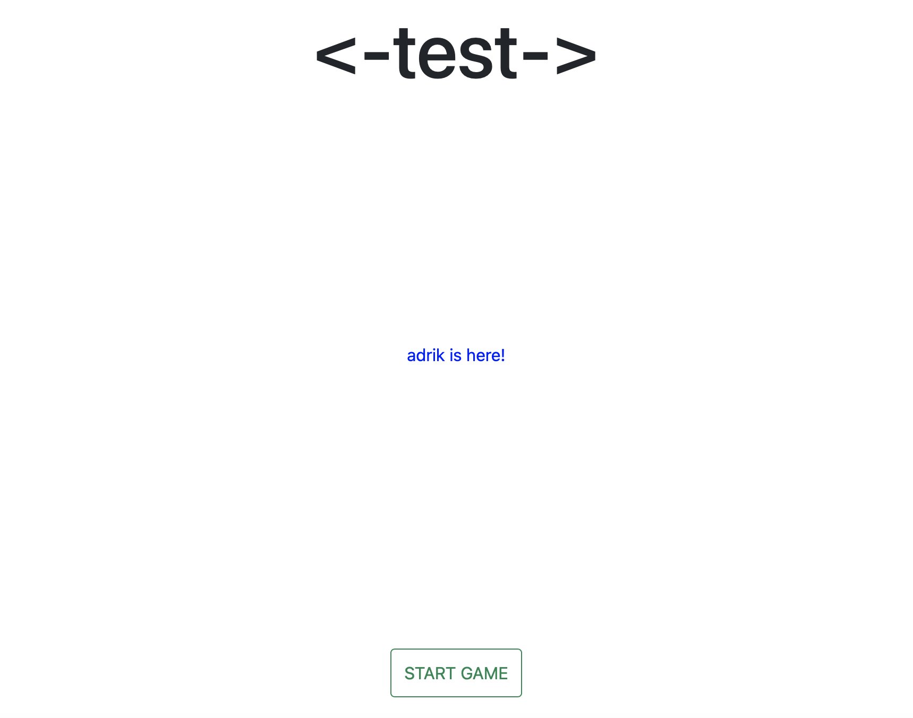
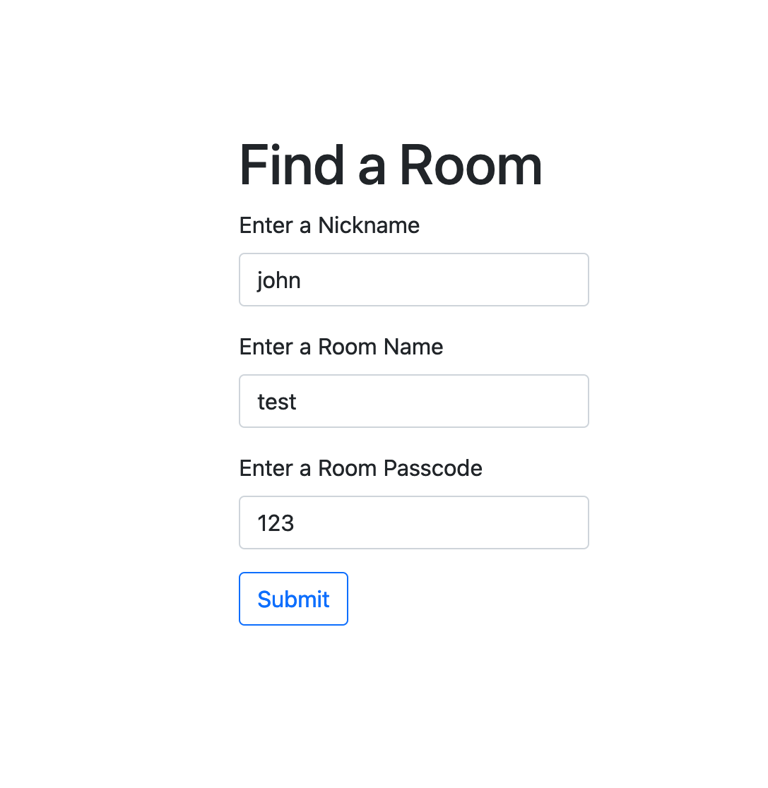
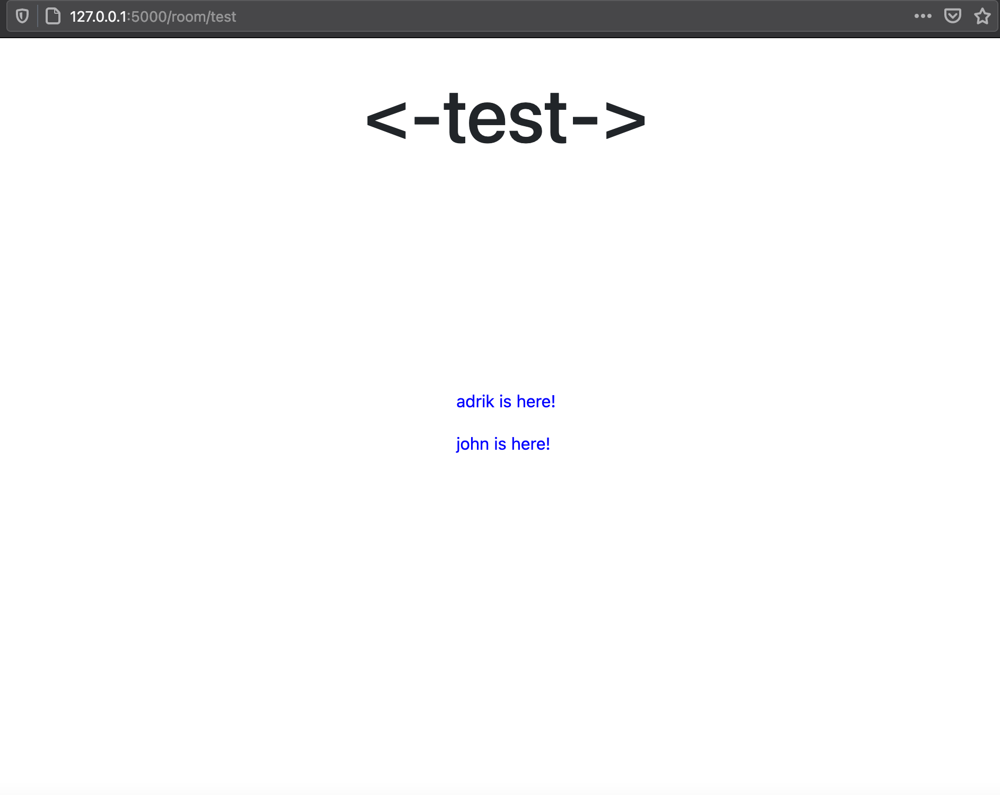
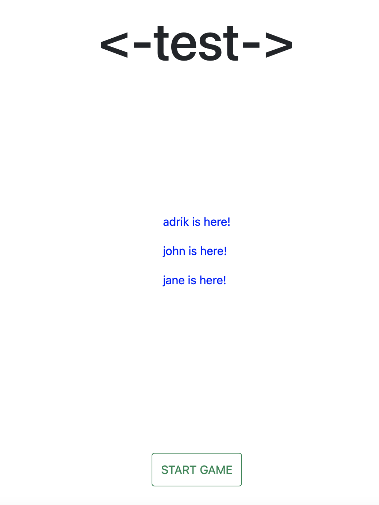
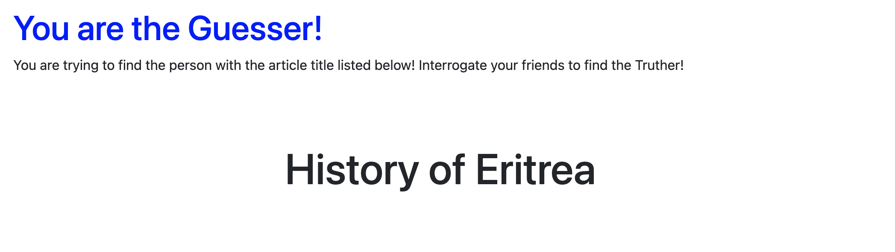
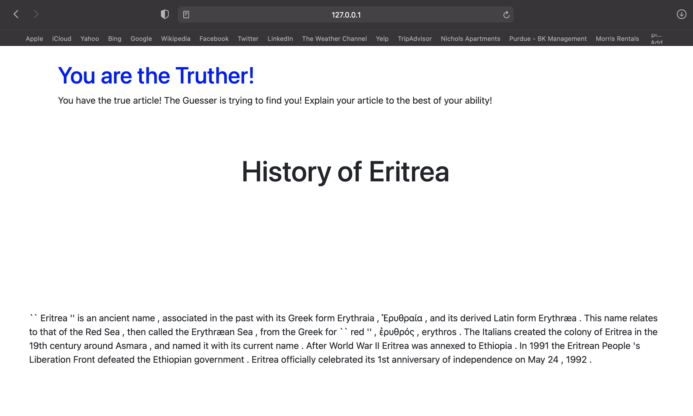
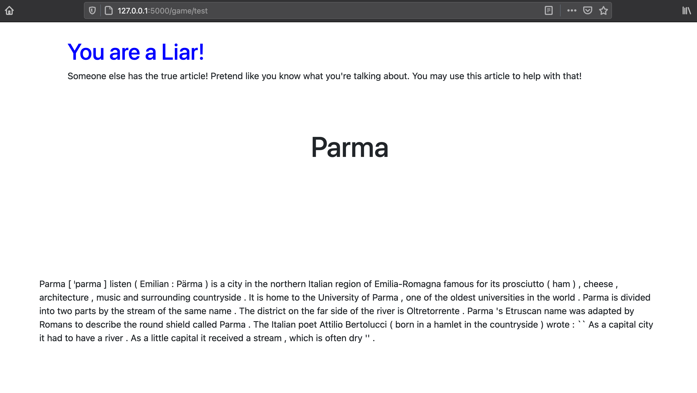

# Wiki Lies Game
Wiki Lies is a web application game developed with the Flask framework in Python. I worked on this to teach myself some simple web development techniques ranging from backend to frontend. The implementation is a bit like how Kahoot works, if you're familiar--users join into rooms based on a room name and code that other users create. The creator can then start the game.
## The Game
The Wiki Lies game--and the idea for this project--come from the YouTube channel **Matt and Tom** (https://www.youtube.com/channel/UCRUULstZRWS1lDvJBzHnkXA) in their featured show *Two Of These People Are Lying*. 4 hosts of this show play the game: one player is the Guesser, and the other three each have a Wikipedia article they've chosen. At random, the Guesser chooses one of the other players' articles, and goes around the room asking the other players questions about the chosen article--only one of them will supply the Guesser the correct information about the chosen article. The object of the game is for the Guesser to narrow down the person with the true article, and for the person with the true article to persuade the Guesser to choose them. All of the other players will try to throw the Guesser off the scent of the person with the true article.
On the YouTube show, this is played manually with paper. The idea of this project is to automate the game in a Kahoot style.
## The Implementation

When the user first accesses the website, the above "Welcome" page is shown, presenting the user the options to either `create` or `join` a room. Let's go through the process of creating a room, and then allowing some players to join. First, we'll select `create` to create a room:  
  

The user is now brought to the room creation page, where they can submit a room name and passcode for other users to join in. We'll submit `test` and `123` for the respective room name and passcode.  
  

The room creator, who has now been tagged the `admin` of the created room, is now brought to the "Choose A Nickname" page, where they can submit a nickname for themselves, which will allow other players to identify them.  
  

After the admin is done creating the room, they are launched to the waiting room, which displays the room's name, the users currently in the room, and--for the admin only--a `start game` button to launch the game when each user is ready. Let's go ahead and create some other users to join the room.  
  

The user is brought to this page if they select `join` on the "Welcome" page, where they can now submit a nickname, and attempt to find a room that has been created by searching for the room name and accessing it with the passcode. If there is no room with the given name, or the provided passcode is incorrect, the submit will fail and an error message will flash. If the room is found and the passcode is correct, the user will be taken right to the waiting room.  
  

Here is user `john`'s screen. You can see that `adrik` is listed, and there is no `start game` button since `john` did not create the room.  
  

Here is `adrik`'s screen after both `john` and another user `jane` has joined. `adrik` can now start the game knowing that all of his friends have joined. The game will randomly select a "Guesser", and the user who will have the true article: called the "Truther". The Guesser will only be given the title of the Truther's article. The Truther, and all other players (called "Liars"), will be supplied a Wikipedia article at random. The article comes from a sqlite database I have pre-loaded with a bunch of articles split into their title and the first paragraph of the article. Let's take a look at everyone's screen after `adrik` starts the game. 
  

Here is the Guesser's page--shown to a user chosen at random. The Guesser is given the title of the article that the Truther has:  
  

Here is the Truther's page--they have the information on the article that the Guesser is given.  
  

Lastly, here is the Liar's page. For each group of users playing in the same room, there is one Guesser, one Truther, and the rest of the players are Liars. Each Liar is supplied a random article, which they can use in the game to stump the Guesser if they wish, but it is not necessary.

---
Thanks to Tom Scott and Matt Gray of the YouTube channel **Matt and Tom** for the project inspiration!  
Once again, here's the link: https://www.youtube.com/channel/UCRUULstZRWS1lDvJBzHnkXA  
Aaand here's the link to the Wikipedia dataset I used for this article: https://thijs.ai/Wikipedia-Summary-Dataset/
